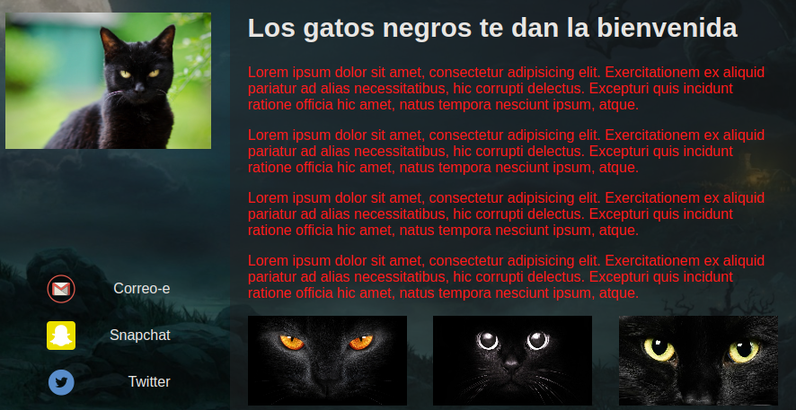
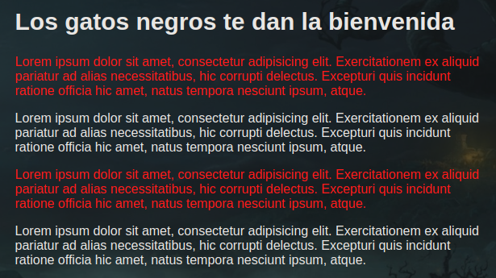
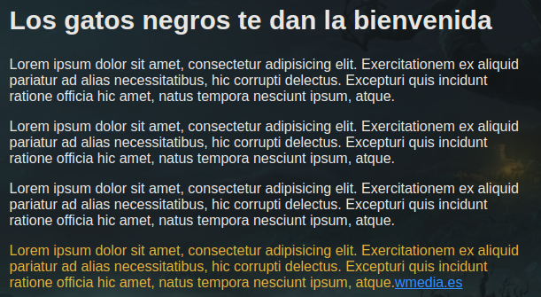
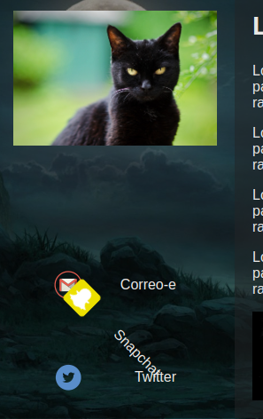

## jQuery

## HTML sobre el que se basaran los ejemplos jQuery
```html
<!DOCTYPE html>
<html lang="en">
<head>
    <meta charset="UTF-8">
    <meta http-equiv="X-UA-Compatible" content="IE=edge">
    <meta name="viewport" content="width=device-width, initial-scale=1.0">
    <title>Document</title>

    <link rel="stylesheet" href="css/main.css">
</head>
<body>
    
    <!-- Contenedor principal -->
    <main>

        <!-- Sidebar -->
        <aside class="lateral">
            

            <!-- Social -->
            <a href="#">
                
                <span>Correo-e</span>
            </a>
            <a href="#">
                
                <span>Snapchat</span>
            </a>
            <a href="#">
                
                <span>Twitter</span>
            </a>
            
        </aside>

        <!-- Contenido -->
        <section class="contenido">
            <h1>Los gatos negros te dan la bienvenida</h1>
            <p>Lorem ipsum dolor sit amet, consectetur adipisicing elit. Exercitationem ex aliquid pariatur ad alias necessitatibus, hic corrupti delectus. Excepturi quis incidunt ratione officia hic amet, natus tempora nesciunt ipsum, atque.</p>
            <p>Lorem ipsum dolor sit amet, consectetur adipisicing elit. Exercitationem ex aliquid pariatur ad alias necessitatibus, hic corrupti delectus. Excepturi quis incidunt ratione officia hic amet, natus tempora nesciunt ipsum, atque.</p>
            <p>Lorem ipsum dolor sit amet, consectetur adipisicing elit. Exercitationem ex aliquid pariatur ad alias necessitatibus, hic corrupti delectus. Excepturi quis incidunt ratione officia hic amet, natus tempora nesciunt ipsum, atque.</p>
            <p>Lorem ipsum dolor sit amet, consectetur adipisicing elit. Exercitationem ex aliquid pariatur ad alias necessitatibus, hic corrupti delectus. Excepturi quis incidunt ratione officia hic amet, natus tempora nesciunt ipsum, atque.</p>

            
            <!-- Thumbnails -->
            <ul>
                <li></li>
                <li></li>
                <li></li>
            </ul>
        </section>
    </main>


    <script src="lib/jquery-3.6.3.min.js"></script>
    <script src="js/script.js"></script>
</body>
</html>
```


### Seleccionar desdendientes directos
```javascript
$('aside > img').fadeOut('slow');
```

### Búsqueda de elementos


```javascript
$('a span').css('color', 'red');
```

### Selectores múltiples
```javascript
$('a, span, p').slideToggle();
```

### Pseudo clases


```javascript
$('p:first').css({
        'font-weight': 'bold',
        'color': 'goldenrod'
});
```

### Búsqueda de elementos en el DOM


```javascript
$('.contenido').find('p').first().css('background-color', 'red');
$('.contenido').find('p').eq(2).css('background-color', 'green');
```

### Encadenar métodos y recorrer el DOM


```javascript
$('.contenido').find('p').last().prev().css('background-color', 'red');
```

### Buscar arriba y abajo en el DOM


```javascript
// parent (solo el primer padre del elemento)
let $parent = $('.lateral').find('span').last().parent();
    $parent.css('border', '1px solid red');
```


```javascript
// parents (todos los padres)
let $parent = $('.lateral').find('span').last().parents();
    $parent.css('border', '1px solid red');
```


```javascript
// children / find
    let $children = $('main').children();
    $children.css('border', '1px solid red');
```


```javascript
// children / find
    let $children = $('main').find('*');
    $children.css({
        'transition': 'all 2s',
        'transform': 'rotate(180deg)'
    });
```

### Insertar contenido en el DOM
Con .after y .before se añade antes o despues del elemento seleccionado


```javascript
    let $enlace = $('<a href="#">Conocer más gatos negros!</a>');
    $('.contenido').find('p').first().after($enlace);
```

### Insertar contenido en el DOM II
Con .prepend y .append se añade dentro del elemento seleccionado al principio o al final.


```javascript
    let $enlace = $('<a href="#">Conocer más gatos negros!</a>');
    $('.contenido').find('p').prepend($enlace);
```

### Eliminar elementos del DOM


```javascript
$('.contenido').find('p').remove();
```

### Interacción en el DOM
Cuando haga click en el enlace de Twitter, todos los parrafos se pondrán en rojo.



```javascript
// Escuchar un <a>
    $('.lateral').find('a').last().on('click', function() {
        $('.contenido').children('p').css('color', 'red');
    });
```

### This


Convertimos "this" en un objeto jquery para poder usar los métodos de jquery. Con "this" obtenemos que el evento se produzca sobre el elemento con el que interaccionamos, en este caso haciendo click.
```javascript
// Escuchar los <p>
    $('.contenido').children('p').on('click', function(evento) {
        evento.preventDefault();
        $(this).css('color', 'red'); //convertir this en objeto jquery
    });
```

### Atributos data
```javascript
// data en este caso es un getter, nos devuelve lo que hay el atributo data-rrss
    /*let $enlace = $('.lateral').find('a').last();
    let valorData = $enlace.data('rrss');
    console.log(valorData);*/

    // data en este caso es un setter, cambia el valor del atributo
    let $enlace = $('.lateral').find('a').last();
    $enlace.data('rrss', 'Nuevo valor')
    let valorData = $enlace.data('rrss');
    console.log(valorData);
```

### Variable cache

```javascript
/*let $parrafo = $('p').last();

    //css
    $parrafo.css('color', 'goldenrod');

    // atributo data
    $parrafo.data('color', 'amarillo');

    // append
    let $enlace = $('<a href="http://www.media.es" target="_blank">wmedia.es</a>');
    $parrafo.append($enlace);*/

    // Method chaining - encadenamiento de métodos
    let $enlace = $('<a href="http://www.media.es" target="_blank">wmedia.es</a>');
    $('p').last().css('color', 'goldenrod').data('color', 'amarillo').append($enlace);
```

### Event delegation
Si ponemos un event listener, este no funcionara sobre elementos que añamos insertado después en el DOM,
para solucionar esto hacemos un event listener delegation, que es pasar un tercer parametro con el 
elemento sobre el que queremos hacer el evento y seleccionamos un elemento del DOM que estuviera en el DOM desde el principio y contenga el elemento sobre el que queremos ejecutar el evento.

```javascript
// event listener directo (no funcionaria con elementos que añadamos después en el DOM)
    /*$('a').on('click', function(evt) {
        evt.preventDefault();
        console.log('A clicked!');
    });*/

    // event listene delegado
    $('main').on('click', 'a', function(evt) {
        evt.preventDefault();
        console.log('A clicked!');
    });
    
    let $enlace = $('<a href="http://www.media.es" target="_blank">wmedia.es</a>');
    $('p').last().css('color', 'goldenrod').data('color', 'amarillo').append($enlace);
```

### Filtrar resultados


```javascript
// selector
    /*let $enlace = $('.lateral').find('a').filter(':odd');
    $enlace.css('transform', 'scale(2)');*/

    // función - test
    let $enlaceSnapchat = $('.lateral').find('a').filter(function (indice, elemento) {
        // console.log(elemento === this); // es this
        return $(elemento).find('span').text() === 'Snapchat';
      });

      console.log($enlaceSnapchat.css('transform', 'rotate(45deg'));
```

### Método slideToggle
slideToggle funciona a modo interruptor mostrar/ocultar contenido. Se le pasan los elementos y se le puede pasar otros parámetros como el tiempo de duración, etc...

En este ejemplo se ocultarán y mostrarán los párrafos, ocultaremos los párrafos al principio añadiendo este estilo al html.

```html
<style>
    .contenido p {
        display: none;
    }
</style>
```

```javascript
let $parrafos = $('.contenido').children('p');

  /*$parrafos.slideToggle(3000, function() {
    console.log('Finalizado!');
  });*/

  $('.lateral').children('img').on('click', function() {
    mostrarEnSecuencia($parrafos);
  })

  function mostrarEnSecuencia($coleccion, tiempo) { 
    tiempo = tiempo || 1000;
    $coleccion.each(function(indice, elemento) {
      $(elemento).slideToggle(tiempo * (indice + 1));
    });
   }
```

### Eventos de ratón

```javascript 
let $parrafos = $('.contenido').children('p');

  $('.lateral').children('img').on('mouseleave', function() {
    mostrarEnSecuencia($parrafos);
  });

  // atajo para mouseenter y mouseleave

  /*$('.lateral').children('img').hover(function(){
    console.log('Entro');
  }, function(){
    console.log('Salgo');
  });*/

  function mostrarEnSecuencia($coleccion, tiempo) { 
    tiempo = tiempo || 1000;
    $coleccion.each(function(indice, elemento) {
      $(elemento).slideToggle(tiempo * (indice + 1));
    });
   }
```