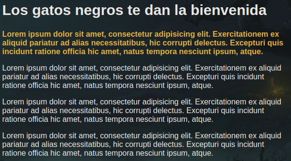
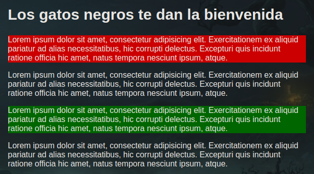
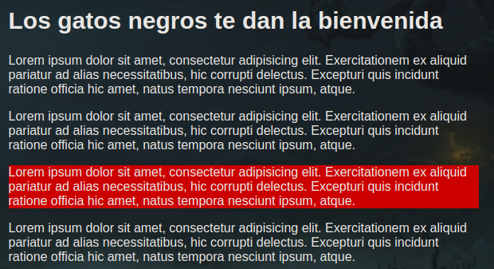
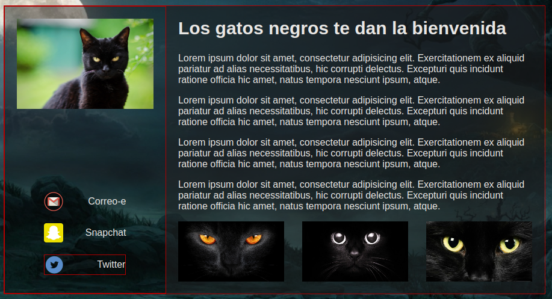
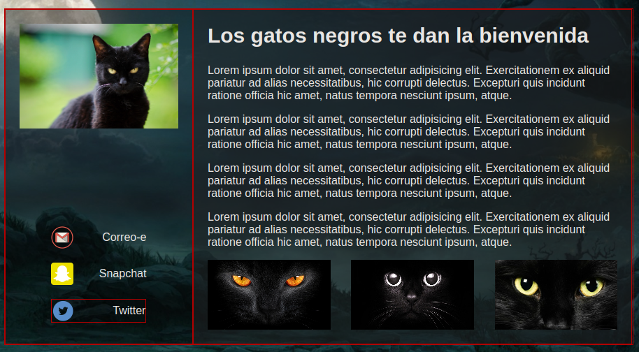
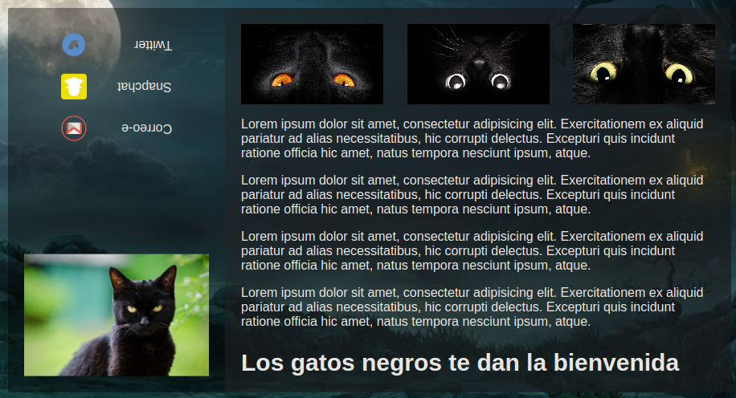
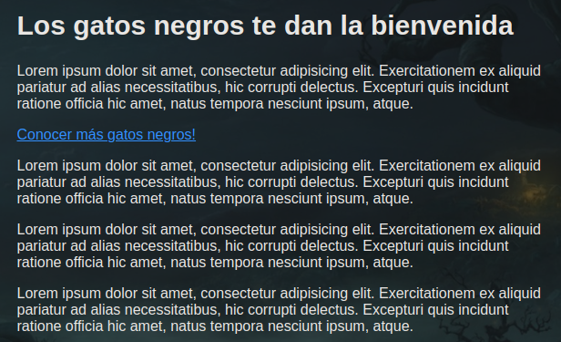
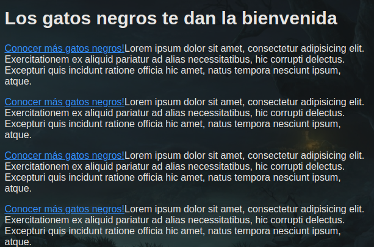

## jQuery


### Seleccionar desdendientes directos

```html
<aside class="lateral">
    
</aside>
```
```javascript
$('aside > img').fadeOut('slow');
```

### Búsqueda de elementos


```html
 <a href="#">
    
    <span>Correo-e</span>
</a>
```
```javascript
$('a span').css('color', 'red');
```

### Selectores múltiples
```javascript
$('a, span, p').slideToggle();
```

### Pseudo clases


```html
<section class="contenido">
    <h1>Los gatos negros te dan la bienvenida</h1>
        <p>Lorem ipsum dolor sit amet, consectetur adipisicing elit.</p>
        <p>Lorem ipsum dolor sit amet, consectetur adipisicing elit.</p>
        <p>Lorem ipsum dolor sit amet, consectetur adipisicing elit.</p>
        <p>Lorem ipsum dolor sit amet, consectetur adipisicing elit.</p>
</section>

```
```javascript
$('p:first').css({
        'font-weight': 'bold',
        'color': 'goldenrod'
});
```

### Búsqueda de elementos en el DOM


```html
<section class="contenido">
        <h1>Los gatos negros te dan la bienvenida</h1>
        <p>Lorem ipsum dolor sit amet, consectetur adipisicing elit.</p>
        <p>Lorem ipsum dolor sit amet, consectetur adipisicing elit.</p>
        <p>Lorem ipsum dolor sit amet, consectetur adipisicing elit.</p>
        <p>Lorem ipsum dolor sit amet, consectetur adipisicing elit.</p>
</section>
```
```javascript
$('.contenido').find('p').first().css('background-color', 'red');
$('.contenido').find('p').eq(2).css('background-color', 'green');
```

### Encadenar métodos y recorrer el DOM



```html
<section class="contenido">
        <h1>Los gatos negros te dan la bienvenida</h1>
        <p>Lorem ipsum dolor sit amet, consectetur adipisicing elit.</p>
        <p>Lorem ipsum dolor sit amet, consectetur adipisicing elit.</p>
        <p>Lorem ipsum dolor sit amet, consectetur adipisicing elit.</p>
        <p>Lorem ipsum dolor sit amet, consectetur adipisicing elit.</p>
</section>
```
```javascript
$('.contenido').find('p').last().prev().css('background-color', 'red');
```

### Buscar arriba y abajo en el DOM

```html
<main>
    <aside class="lateral">
        
    
        <!-- Social -->
        <a href="#">
            
            <span>Correo-e</span>
        </a>
        <a href="#">
            
            <span>Snapchat</span>
        </a>
        <a href="#">
            
            <span>Twitter</span>
        </a>
                
    </aside>
    
    <!-- Contenido -->
    <section class="contenido">
        <h1>Los gatos negros te dan la bienvenida</h1>
        <p>Lorem ipsum dolor sit amet, consectetur adipisicing elit. </p>
        <p>Lorem ipsum dolor sit amet, consectetur adipisicing elit. </p>
        <p>Lorem ipsum dolor sit amet, consectetur adipisicing elit. </p>
        <p>Lorem ipsum dolor sit amet, consectetur adipisicing elit. </p>
                
        <!-- Thumbnails -->
        <ul>
            <li></li>
            <li></li>
            <li></li>
        </ul>
    </section>    
</main>        
```

```javascript
// parent (solo el primer padre del elemento)
let $parent = $('.lateral').find('span').last().parent();
    $parent.css('border', '1px solid red');
```


```javascript
// parents (todos los padres)
let $parent = $('.lateral').find('span').last().parents();
    $parent.css('border', '1px solid red');
```


```javascript
// children / find
    let $children = $('main').children();
    $children.css('border', '1px solid red');
```

```javascript
// children / find
    let $children = $('main').find('*');
    $children.css({
        'transition': 'all 2s',
        'transform': 'rotate(180deg)'
    });
```

### Insertar contenido en el DOM
Con .after y .before se añade antes o despues del elemento seleccionado

```html
<section class="contenido">
    <h1>Los gatos negros te dan la bienvenida</h1>
    <p>Lorem ipsum dolor sit amet, consectetur adipisicing elit.</p>
    <p>Lorem ipsum dolor sit amet, consectetur adipisicing elit.</p>
    <p>Lorem ipsum dolor sit amet, consectetur adipisicing elit.</p>
    <p>Lorem ipsum dolor sit amet, consectetur adipisicing elit.</p>
</section>
```
```javascript
    let $enlace = $('<a href="#">Conocer más gatos negros!</a>');
    $('.contenido').find('p').first().after($enlace);
```

### Insertar contenido en el DOM II
Con .prepend y .append se añade dentro del elemento seleccionado al principio o al final.

```html
<section class="contenido">
    <h1>Los gatos negros te dan la bienvenida</h1>
    <p>Lorem ipsum dolor sit amet, consectetur adipisicing elit.</p>
    <p>Lorem ipsum dolor sit amet, consectetur adipisicing elit.</p>
    <p>Lorem ipsum dolor sit amet, consectetur adipisicing elit.</p>
    <p>Lorem ipsum dolor sit amet, consectetur adipisicing elit.</p>
</section>
```
```javascript
    let $enlace = $('<a href="#">Conocer más gatos negros!</a>');
    $('.contenido').find('p').prepend($enlace);
```

### Eliminar elementos del DOM

```html
<section class="contenido">
    <h1>Los gatos negros te dan la bienvenida</h1>
    <p>Lorem ipsum dolor sit amet, consectetur adipisicing elit.</p>
    <p>Lorem ipsum dolor sit amet, consectetur adipisicing elit.</p>
    <p>Lorem ipsum dolor sit amet, consectetur adipisicing elit.</p>
    <p>Lorem ipsum dolor sit amet, consectetur adipisicing elit.</p>
</section>
```
```javascript
$('.contenido').find('p').remove();
```